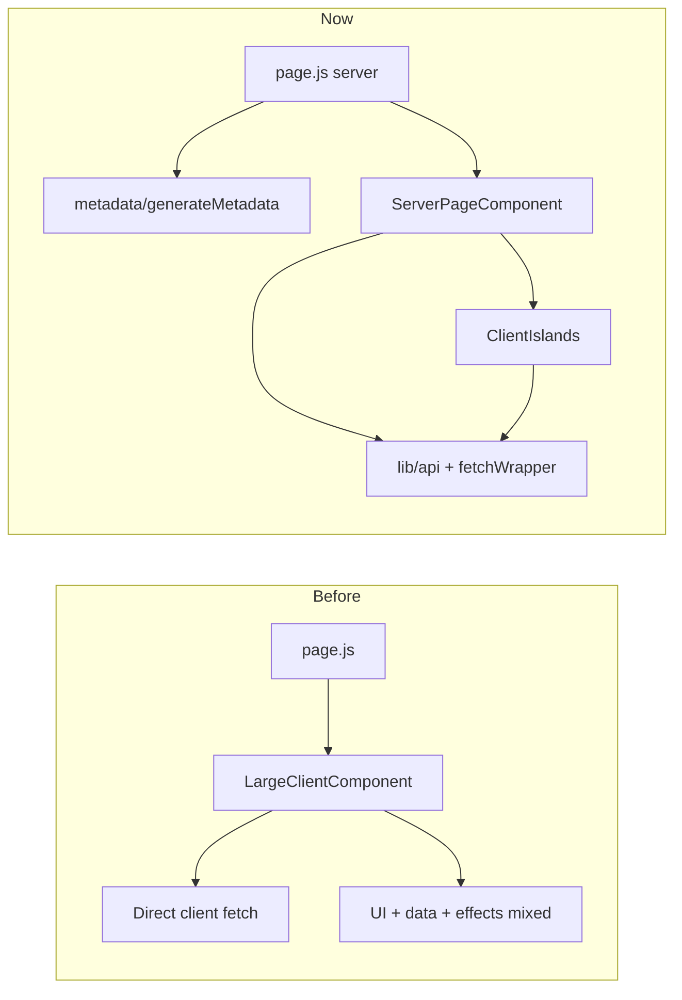
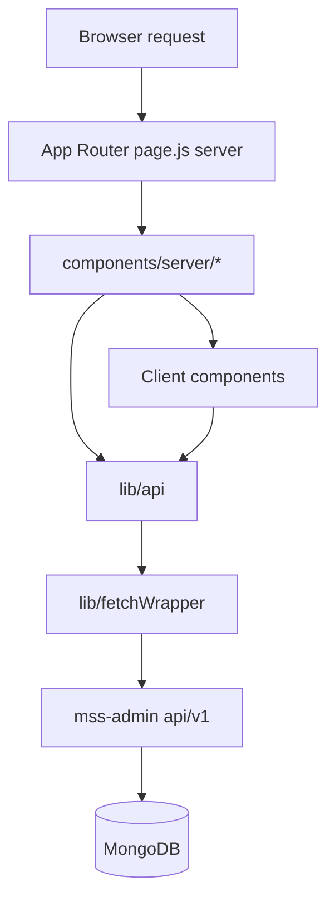
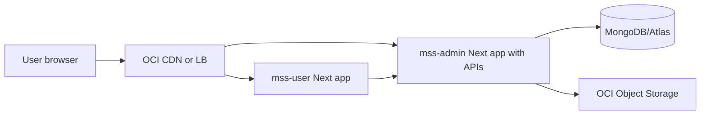

# MyShaadiStore User Architecture: Before vs Now vs Next

## What Changed in `mss-user`

- All `src/app/**/page.js` files are server-side entry points.
- SEO is handled at page level (`metadata` / `generateMetadata`).
- Each page delegates rendering/data orchestration to a dedicated server component in `src/components/server/`.
- Client code is split into focused interactive islands (forms, local state, browser APIs, payments).
- API access is centralized through `src/lib/fetchWrapper.js` and `src/lib/api.js`.
- Critical actions now use idempotency keys on client requests.

## Before vs Now (High-Level)

## Current Data Flow

## Why Most APIs Are in `mss-admin` Right Now

- This repo currently behaves like a **single backend surface** (`mss-admin` app) serving:
  - admin APIs,
  - user auth APIs,
  - user commerce APIs.
- Practical reasons this was likely done:
  - one DB connection layer,
  - one deployment for API logic,
  - faster initial development.
- `mss-user` is currently a frontend app (with server rendering), not a full backend service.

## Can We Split User and Admin APIs?

Yes, and it is a good long-term move.

### Option A: Keep one backend, separate route namespaces (fastest)

- Keep APIs in one service but separate clearly:
  - `/api/v1/admin/*`
  - `/api/v1/user/*`
  - `/api/v1/public/*`
- Add auth middleware with role checks per namespace.
- Best if team is small and you want lower ops overhead.

### Option B: Separate backend services (cleanest at scale)

- `mss-admin-api` service for admin operations only.
- `mss-user-api` service for customer/auth/order flows.
- Shared DB but separate codebases and deployment pipelines.
- Best for stronger isolation, scaling, and security boundaries.

### Option C: Keep `mss-user` frontend-only + dedicated API gateway

- User UI stays pure app/frontend.
- APIs live in dedicated backend(s), exposed via gateway.
- Good if you want enterprise-grade networking/policies.

## Recommended Direction For You (Oracle Deployment)

- Short term: **Option A** (single backend, strict namespace + middleware).
- Mid term: move to Option B when team/product grows.

## Oracle Deployment Approach

### Suggested topology

### Practical setup

- Deploy `mss-user` and `mss-admin` as separate services (Container Instance/OKE/VM).
- Put them behind OCI Load Balancer with domain routing:
  - `app.yourdomain.com` -> `mss-user`
  - `api.yourdomain.com` -> `mss-admin`
  - `admin.yourdomain.com` -> `mss-admin` admin UI (optional separate host rule)
- Set `NEXT_PUBLIC_API_URL=https://api.yourdomain.com` in `mss-user`.
- Keep OCI Object Storage credentials only in backend env (never in client).

### Security checklist

- Enforce CORS allowlist (`app` + `admin` domains only).
- Use HTTPS everywhere.
- Add rate limits on OTP/login/order endpoints.
- Add backend-level idempotency store (DB/Redis) for payment/order endpoints.
- Use secure cookies or short-lived JWT + refresh strategy.

## Idempotency Note

- Current frontend sends idempotency keys and dedupes duplicate requests client-side.
- For true production safety, implement backend idempotency persistence on:
  - `POST /orders`
  - `POST /orders/verify-payment`
  - `POST /quotation-requests`
  - critical auth reset/signup flows.

## What To Do Next

- Add backend idempotency table/collection + middleware in `mss-admin`.
- Move route ownership by namespace (`admin`, `user`, `public`) even if same codebase.
- Add observability (request IDs, error tracing, payment audit logs).
- Add integration tests for order/payment and OTP flows.

