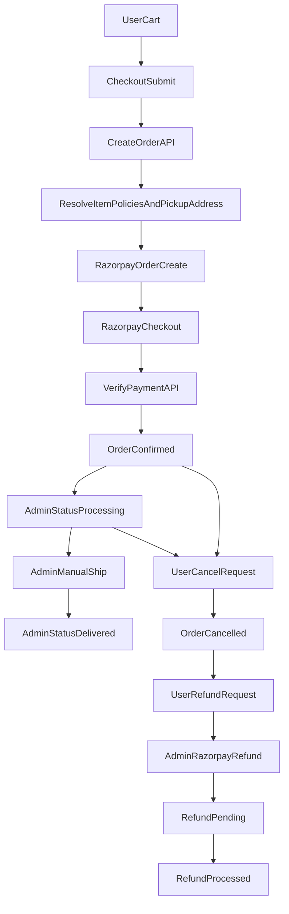
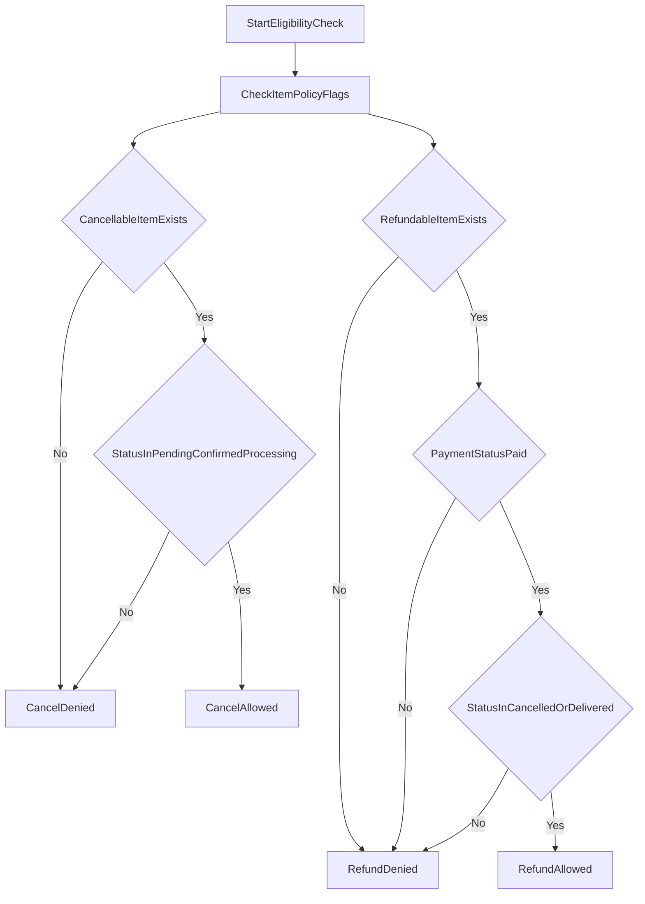

# Order, Shipping, Cancellation, and Refund Flow

This document explains the end-to-end flow implemented across `mss-user` and `mss-admin` for:
- cart to order
- manual shipping
- delivery status progression
- cancellation
- Razorpay refund
- per-item admin-controlled eligibility
- vendor-specific pickup addresses

## 1) Core principles

- Order is created from cart snapshot, but item-level policy and pickup details are resolved on backend at order creation time.
- Admin decides policy at item level:
  - `policies.cancellable`
  - `policies.refundable`
  - `policies.cancellation_window_hours`
  - `policies.refund_window_days`
- Vendor pickup addresses are managed at vendor profile level and attached to each order item snapshot (`pickup_address`).
- Shipping flow supports manual shipment updates from admin.
- Refund processing is Razorpay-backed from admin panel/API.

## 2) Data model highlights

### Order

- `status`: `Pending | Confirmed | Processing | Shipped | Delivered | Cancelled | Payment Failed`
- `payment_status`: `Created | Paid | Refund Pending | Refunded | Failed`
- `items[]` includes:
  - item snapshot (`item_id`, `name`, `price`, `quantity`, etc.)
  - `vendor_id`
  - `policies` snapshot (`cancellable`, `refundable`, windows)
  - `pickup_address` snapshot from vendor default pickup address
- `shipment` for manual fulfillment:
  - `mode: "manual"`
  - `courier_name`, `tracking_number`, `tracking_url`, `shipped_at`
- `cancellation` and `refund` blocks for lifecycle/audit.

### Vendor

- `pickup_addresses[]`:
  - `label`, `line1`, `line2`, `city`, `state`, `pincode`
  - `contact_name`, `contact_phone`
  - `is_default`

## 3) End-to-end flow

## 4) API map

### User-facing

- `POST /api/v1/orders` create order + Razorpay order
- `POST /api/v1/orders/verify-payment` verify payment
- `GET /api/v1/user/orders` fetch customer orders
- `POST /api/v1/user/orders/:orderId/cancel` cancel eligible order
- `POST /api/v1/user/orders/:orderId/refund` request refund

### Admin-facing

- `PUT /api/v1/admin/orders/:orderId/status` update order status
- `POST /api/v1/admin/orders/:orderId/manual-ship` manual shipping update
- `POST /api/v1/admin/orders/:orderId/cancel` admin cancellation
- `POST /api/v1/admin/orders/:orderId/refund` initiate Razorpay refund

## 5) Policy enforcement

- Cancellation allowed only when:
  - order status is `Pending | Confirmed | Processing`
  - at least one item has `policies.cancellable === true`
- Refund allowed only when:
  - payment status is `Paid`
  - order status is `Cancelled | Delivered`
  - at least one item has `policies.refundable === true`

## 6) Admin operations guidance

- Define item policy in item create/edit form.
- Maintain vendor pickup addresses in vendor create/edit form.
- For shipping:
  - use manual shipment with courier + tracking number.
- For cancellation:
  - use cancel action with reason.
- For refunds:
  - use refund action (full if amount omitted, partial if amount supplied).

## 7) Notes

- Existing Shiprocket endpoint remains available, but manual shipping is primary operational path.
- Refund final status can also be synced by Razorpay webhook (`refund.processed`) where available.
